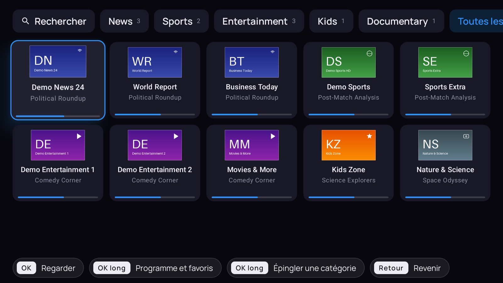
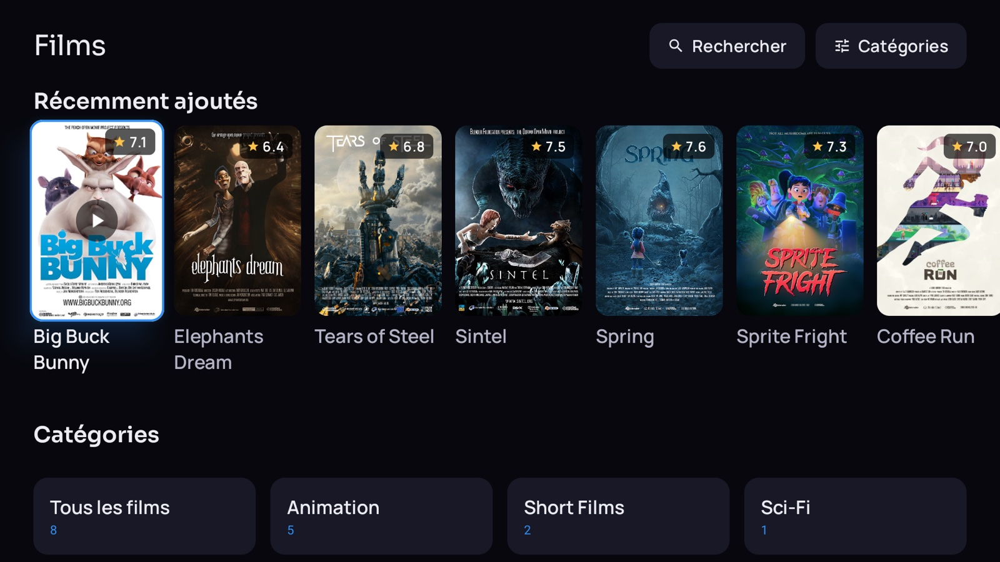
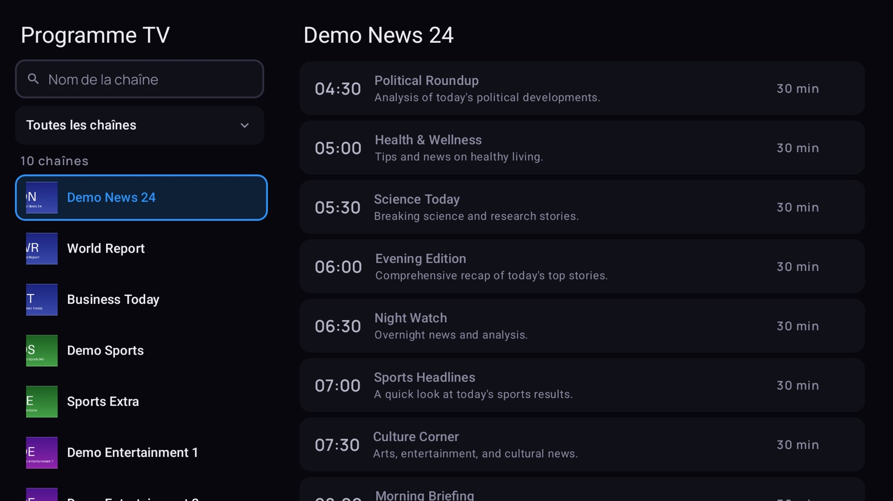
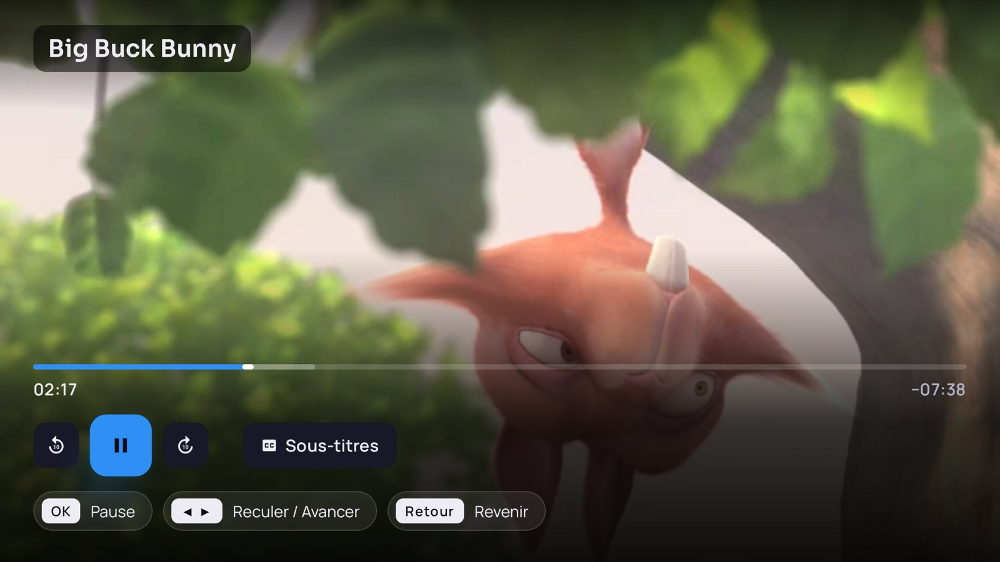
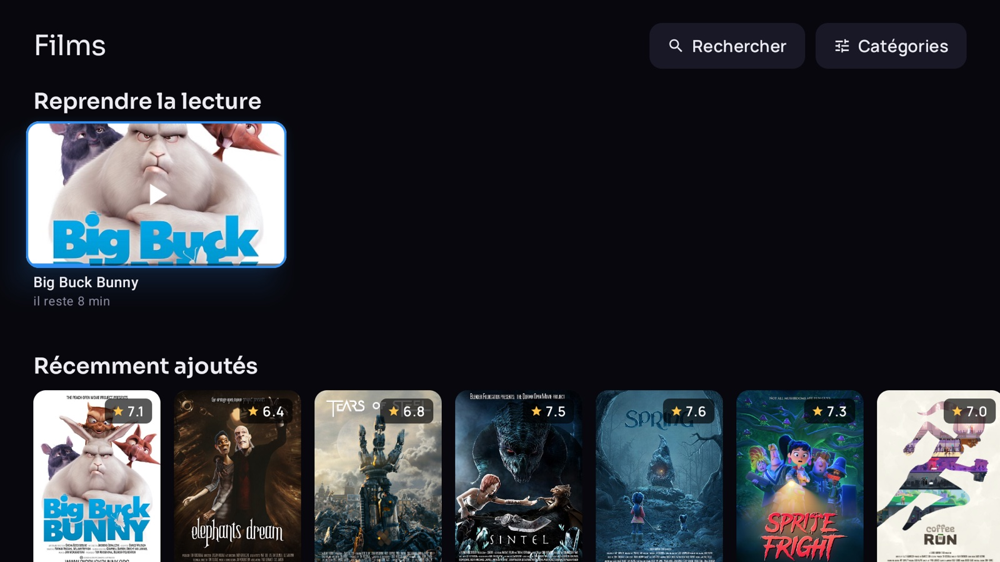
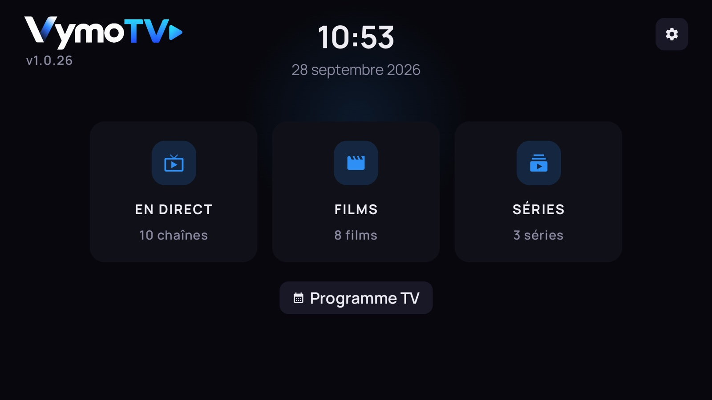
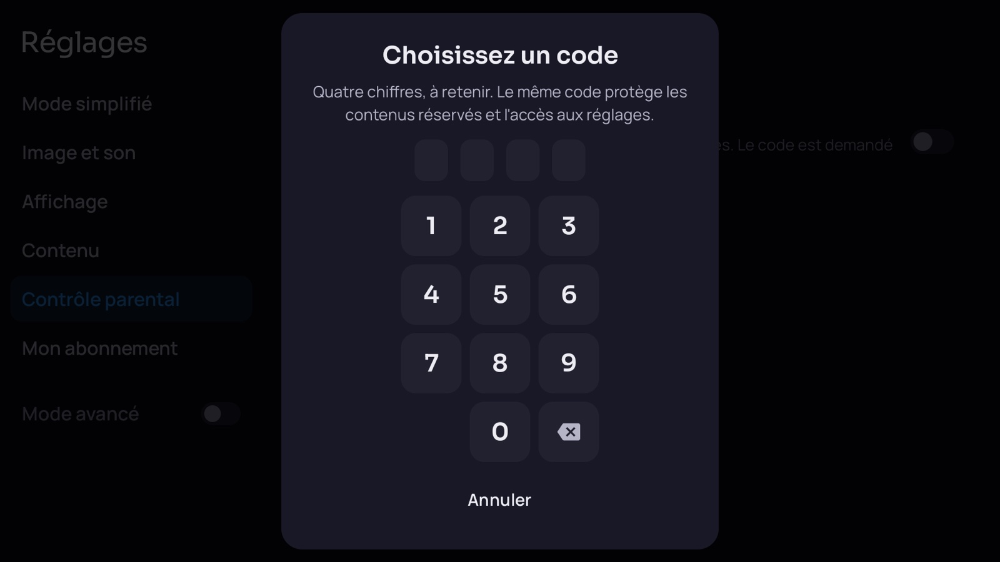
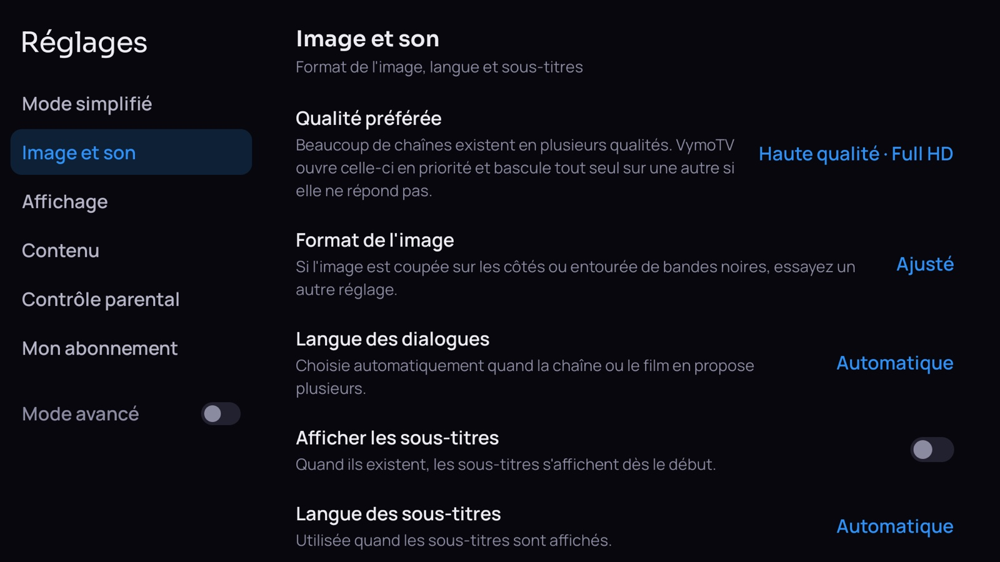

  

  
  
  
  

  <b><a href="https://vymotv.github.io/VymoTV-releases/">Page de présentation</a></b>
  &nbsp;·&nbsp;
  <b><a href="../../releases/latest/download/VymoTV.apk">Télécharger l'APK</a></b>
  &nbsp;·&nbsp;
  <b><a href="confidentialite.md">Confidentialité</a></b>
  &nbsp;·&nbsp;
  <b><a href="../../releases">Toutes les versions</a></b>

 

<table>
  <tr>
    <td width="50%"></td>
    <td width="50%"></td>
  </tr>
  <tr>
    <td align="center"><b>La mosaïque du direct</b> l'émission en cours sous chaque chaîne</td>
    <td align="center"><b>Films et séries</b> affiches, notes, catégories</td>
  </tr>
  <tr>
    <td width="50%"></td>
    <td width="50%"></td>
  </tr>
  <tr>
    <td align="center"><b>Le programme télé</b> les chaînes à gauche, leur journée à droite</td>
    <td align="center"><b>Le lecteur</b> sous-titres, pistes audio, retour arrière</td>
  </tr>
</table>

 

<h2 align="center">Installer</h2>

<table>
<tr>
<td width="55%" valign="top">

### Avec Downloader — le plus simple

1. Depuis le Play Store de votre téléviseur, installez **Downloader** (l'application à l'icône orange).
2. Ouvrez-la et saisissez le code ci-contre, puis validez.
3. Android demandera l'autorisation d'installer depuis cette source : **acceptez**.
4. Ouvrez VymoTV, saisissez **l'adresse de votre serveur** et vos identifiants.

Il n'y a pas de compte VymoTV à créer. Les mises à jour suivantes se font depuis
l'application — **Réglages → Mon abonnement → Mise à jour de l'application**.

</td>
<td width="45%" valign="middle" align="center">

CODE DOWNLOADER

# `4795784`

Il pointe toujours sur la dernière version. Rien à refaire à chaque mise à jour.

</td>
</tr>
</table>

**Sans Downloader :** prenez `VymoTV.apk` dans la [dernière version](../../releases/latest),
copiez-le sur la box par clé USB ou par `adb install`, et ouvrez-le.

 

<h2 align="center">Ce que ça change</h2>

<table>
<tr>
<td width="46%"></td>
<td valign="top">

### On voit ce qui passe, pas des noms

La mosaïque du direct affiche sous chaque chaîne **l'émission en cours** et une barre qui dit
où elle en est. On choisit avec les yeux, pas en lisant trois cents lignes de texte.

Une rubrique « Récemment vues » remonte celles que vous venez de regarder. Un appui long ouvre
la chaîne : ses favoris, sa soirée, et le replay quand le serveur le permet.

Les chaînes publiées en plusieurs qualités sont repliées sous **une seule vignette**, et
VymoTV ouvre le meilleur flux qui répond — si celui-ci se tait, il bascule tout seul sur le
suivant sans rien demander.

</td>
</tr>

<tr>
<td valign="top">

### Le programme, sans chercher

Les chaînes à gauche, leur journée à droite : l'ordre d'un programme papier. Une barre suit
l'heure qu'il est.

Un champ de recherche pour retrouver une chaîne **par son nom**, des filtres pour ne garder
que le sport, l'info ou les enfants. C'est aussi là qu'on masque pour de bon une chaîne qui ne
sert jamais — elle disparaît alors de la mosaïque aussi.

Favoris et chaînes masquées sont les mêmes partout : réglé une fois, réglé partout.

</td>
<td width="46%"></td>
</tr>

<tr>
<td width="46%"></td>
<td valign="top">

### Les films reprennent tout seuls

Les affiches, la note, la catégorie : on reconnaît un film avant d'avoir lu son titre.

Et s'il reste en cours, la reprise est proposée **directement depuis la liste** — pas besoin de
rouvrir la fiche pour retrouver où on en était. Les séries suivent le même principe, épisode
par épisode, avec le prochain à regarder mis en avant.

</td>
</tr>

<tr>
<td valign="top">

### Une fiche par titre

Le résumé, la note, l'année, la durée, la réalisation, la distribution, le pays.

Et en dessous, les titres voisins de la même catégorie — pour ne pas repartir de la liste
quand celui-ci ne convient pas.

</td>
<td width="46%"></td>
</tr>

<tr>
<td width="46%"></td>
<td valign="top">

### Un lecteur qui ne demande rien

Barre de progression, sous-titres et pistes audio à portée d'**OK**, retour arrière quand le
serveur le permet.

Chaque écran rappelle en bas ce que font les touches : personne n'a besoin d'apprendre quoi
que ce soit. Si l'image se fige, un bouton propose une autre qualité sans quitter la lecture.

En direct, une petite annonce prévient avant la fin d'une émission, avec ce qui suit. Elle
s'efface toute seule et ne demande rien.

</td>
</tr>

<tr>
<td valign="top">

### Et une version pour ceux que ça dépasse

Un réglage, et l'accueil ne garde que **trois grandes portes** : Direct, Films, Séries. Le
clavier, les réglages du lecteur et les informations d'abonnement disparaissent de l'écran, et
le direct s'ouvre directement sur les favoris.

Un second réglage agrandit tous les textes. De quoi l'installer chez les parents sans être
rappelé le lendemain.

</td>
<td width="46%"></td>
</tr>

<tr>
<td width="46%"></td>
<td valign="top">

### Un contrôle parental qui verrouille ce que vous désignez

Un code à quatre chiffres protège les catégories que vous choisissez, **une par une** — pas un
interrupteur qui protège on ne sait quoi. Elles demandent le code pour s'ouvrir.

Le même code peut verrouiller les réglages eux-mêmes, pour que rien ne se dérègle par
accident. Et un réglage à part fait disparaître les contenus réservés aux adultes des listes.

</td>
</tr>
</table>

 

<h2 align="center">Huit langues</h2>

  L'interface suit la langue du téléviseur, sans rien à régler.

<table align="center">
  <tr>
    <td align="center">🇫🇷 <b>Français</b> France, Belgique</td>
    <td align="center">🇬🇧 <b>English</b> UK, US</td>
    <td align="center">🇪🇸 <b>Español</b> España</td>
    <td align="center">🇵🇹 <b>Português</b> Portugal, Brasil</td>
  </tr>
  <tr>
    <td align="center">🇩🇪 <b>Deutsch</b> Deutschland</td>
    <td align="center">🇮🇹 <b>Italiano</b> Italia</td>
    <td align="center">🇳🇱 <b>Nederlands</b> Nederland</td>
    <td align="center">🌐 <b>العربية</b> de droite à gauche</td>
  </tr>
</table>

Et si quelqu'un du foyer préfère une autre langue que celle de l'écran, Android laisse la
choisir application par application.

**L'arabe se lit de droite à gauche, et l'interface se retourne avec** : le logo passe à
droite, les trois portes se lisent dans le bon ordre, les dates sortent en arabe. Les dates,
les heures et les nombres suivent la langue partout ailleurs aussi — « 28 septembre 2026 » en
français, « September 28, 2026 » en anglais.

 

<h2 align="center">Tous les réglages</h2>

  

Tout est écrit en français clair, et ce qui peut casser la lecture est rangé derrière un
interrupteur **Mode avancé**.

| Rubrique | Ce qu'on y règle |
|:--|:--|
| **Mode simplifié** | Les trois portes, le très grand texte, les rayons à garder, le verrouillage des réglages |
| **Image et son** | Qualité préférée, format de l'image, langue des dialogues et des sous-titres |
| **Affichage** | Taille du texte, couleur d'accent, écran de démarrage, animations, images de fond |
| **Contenu** | Pays affichés, contenus adultes, reprise de lecture, regroupement par qualité, chaînes masquées |
| **Contrôle parental** | Le code à quatre chiffres, les catégories verrouillées une par une |
| **Mon abonnement** | État, date d'expiration, adresse du serveur, mise à jour du contenu et de l'application |
| **Lecture avancée** | Mémoire tampon, décodage matériel, tunneling vidéo, pas de saut, seuil « terminé » |
| **TV en direct** | Zapping par numéro, numéros et logos, durée du bandeau, annonce de fin d'émission |
| **Guide des programmes** | Source (API du panel ou XMLTV), décalage horaire, jours de rattrapage, import complet |
| **Serveur** | Format de flux (TS ou HLS), mode compatible pour le rattrapage |
| **Réseau et cache** | Résolveur DNS chiffré, serveur relais, délais, réessais, fraîcheur du catalogue |

 

<h2 align="center">Et aussi</h2>

|  |  |
|:--|:--|
| **Plusieurs abonnements** | Jusqu'à cinq, chacun avec ses chaînes, son guide et ses favoris. On passe de l'un à l'autre depuis l'accueil. |
| **Ça s'ouvre même quand ça rame** | Le catalogue et le guide restent sur le téléviseur. L'application s'affiche tout de suite et se met à jour derrière, sans écran d'attente. |
| **La recherche marche hors ligne** | Films, séries et chaînes déjà reçus sont cherchés sur l'appareil. Deux lettres suffisent, et la dictée évite le clavier quand la télécommande a un micro. |
| **Les mises à jour arrivent seules** | L'application vérifie s'il existe une version plus récente et propose de l'installer. Pas de fichier à retélécharger à la main. |
| **Un test de débit** | Latence, débit descendant et montant, latence du serveur IPTV — et le verdict en clair : ce qu'on peut regarder avec cette ligne. |
| **Démarrage automatique** | VymoTV peut s'ouvrir à l'allumage du téléviseur, et reprendre la dernière chaîne regardée. |

 

<h2 align="center">Ce qui ne sort pas de chez vous</h2>

VymoTV ne contient **aucune régie publicitaire, aucun outil de mesure d'audience, aucun rapport
de plantage**. Il n'y a pas de compte VymoTV, donc rien à quoi rattacher ce que vous regardez.

Vos identifiants restent sur le téléviseur et ne partent qu'au serveur dont vous avez saisi
l'adresse.

Trois services extérieurs peuvent être contactés, tous facultatifs :

| Service | Quand | Par défaut |
|:--|:--|:--|
| Cloudflare, Hetzner ou Scaleway | si vous lancez le test de débit | à la demande |
| ipwho.is | si vous activez « Afficher l'adresse et l'opérateur » | désactivé |
| Résolveur DNS chiffré | si vous l'activez | désactivé |
| GitHub | pour savoir si une version plus récente existe | activé |

**Autorisations demandées :** Internet, état du réseau, maintien de l'écran allumé, démarrage
automatique. Ce sont les quatre seules — **pas de microphone** : la dictée vocale ouvre le
service d'Android, qui écoute à sa place et ne rend que le texte.

Le détail est dans la [politique de confidentialité](confidentialite.md).

 

<h2 align="center">Ce qu'il vous faut</h2>

Un **abonnement compatible Xtream Codes**, que VymoTV ne vend pas et ne fournit pas. Sans
abonnement, l'application n'affiche rien.

Un appareil sous **Android TV 5.0 ou plus récent** : téléviseur Android ou Google TV, Fire TV,
box Android. L'application est faite pour la télécommande — elle fonctionne aussi à la souris,
mais ce n'est pas pour ça qu'elle est dessinée.

 

---

### À propos de ce dépôt

Il ne contient que les applications compilées. **Le code source n'est pas public.**

Il l'est pour une seule raison : les box installées chez les clients interrogent cette page
pour savoir s'il existe une version plus récente. Un dépôt privé les obligerait à présenter un
mot de passe, donc à en contenir un — et un mot de passe dans une application est un mot de
passe que n'importe qui peut en extraire.

### Licence

**Logiciel propriétaire — © 2026 VymoTV. Tous droits réservés.**

Aucune licence n'est accordée. La copie, la modification, la redistribution, la republication
et l'ingénierie inverse sont interdites sans autorisation écrite de VymoTV. Les applications
publiées ici sont mises à disposition des seuls clients de VymoTV, pour l'usage de leur
abonnement, sur leurs propres appareils. Voir [LICENSE](LICENSE).

VymoTV est un lecteur : il ne fournit, n'héberge et ne distribue aucun contenu audiovisuel.
Les captures de cette page proviennent d'un serveur de démonstration public.
